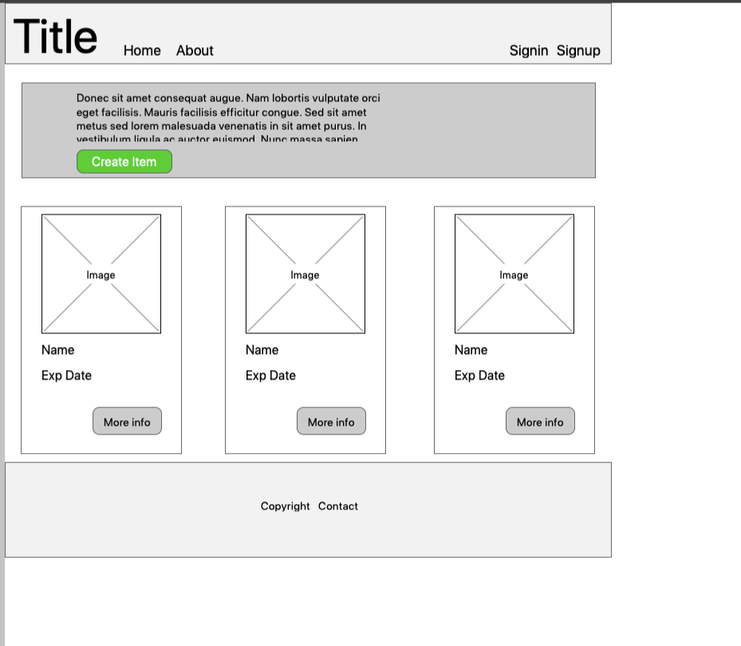
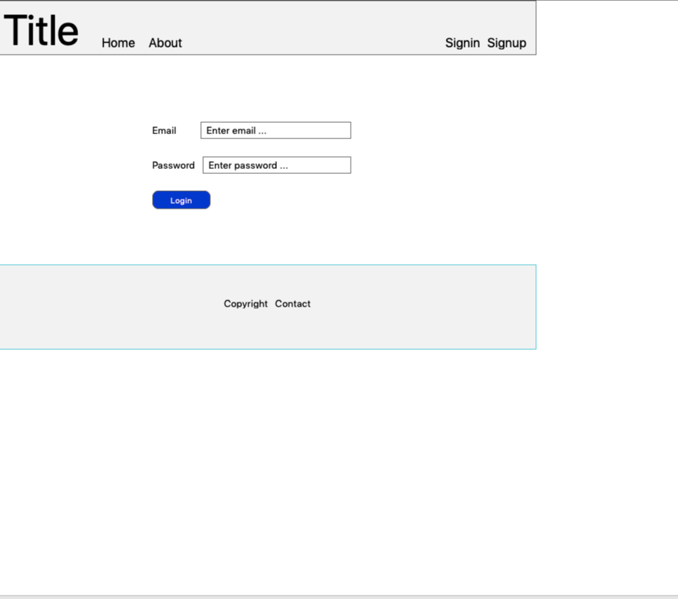
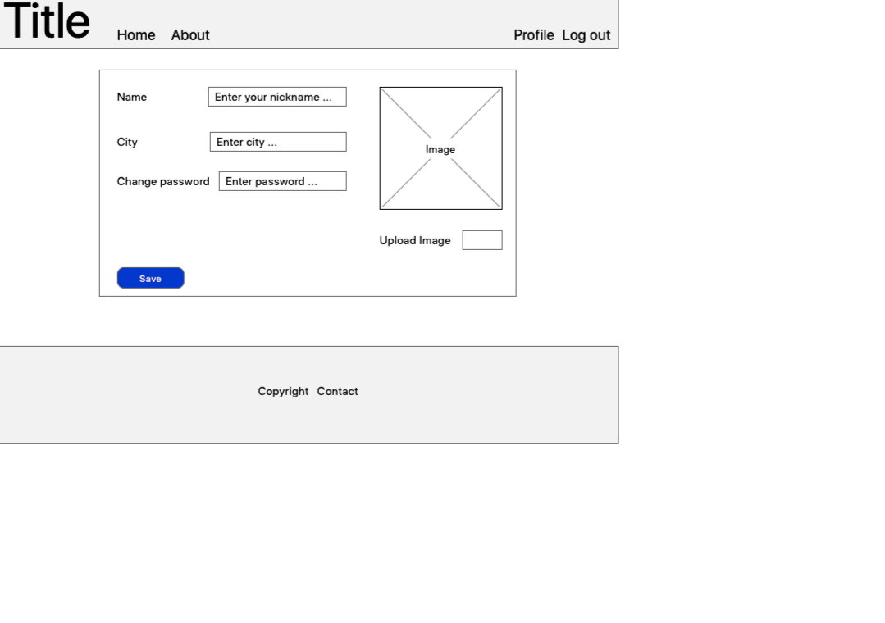
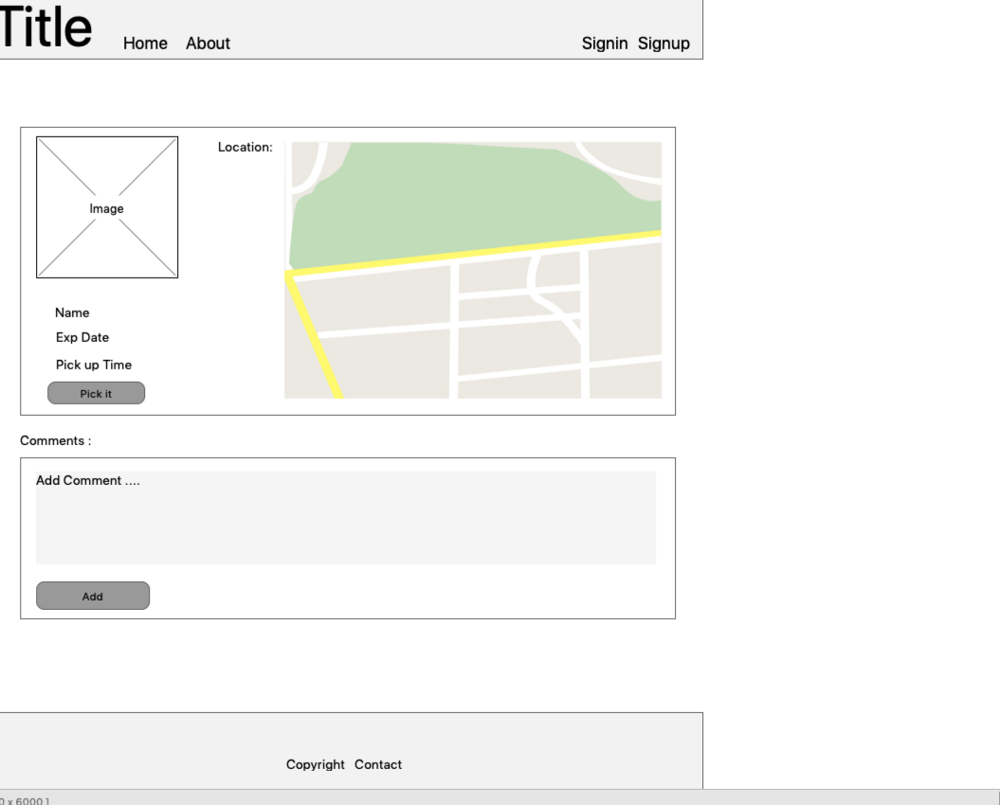
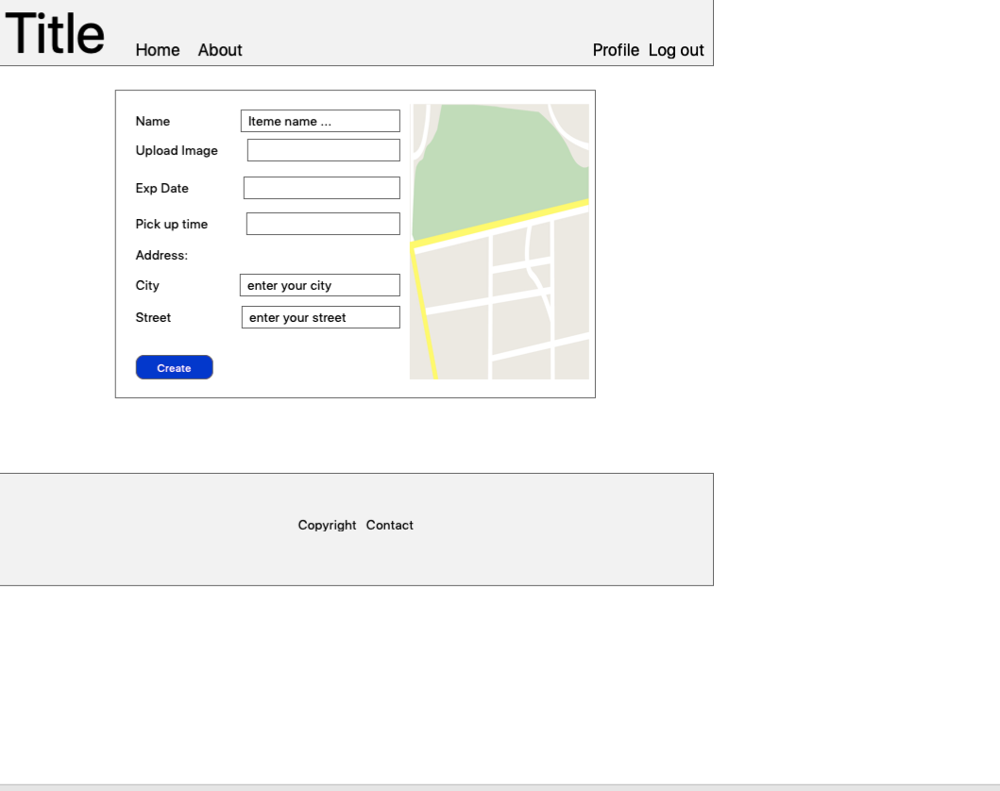
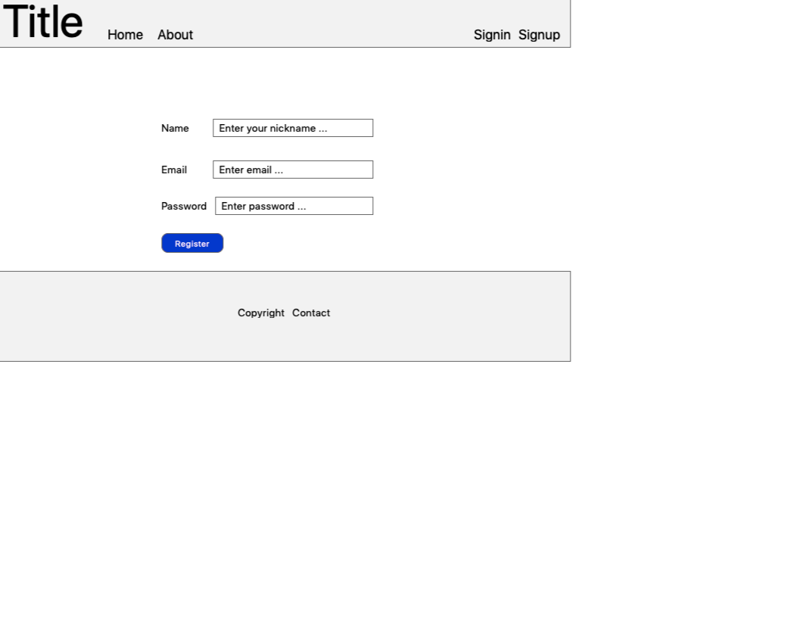
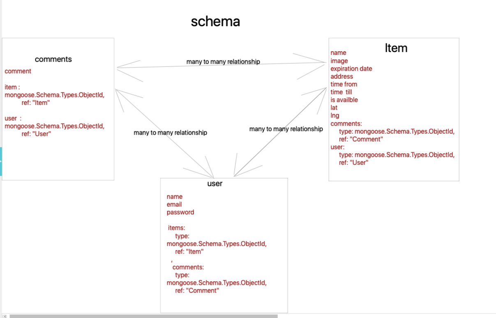

# !WASTE

# About 

!WASTE connects neighbours with each other and with local businesses so surplus food can be shared, not thrown away. This could be spare home-grown vegetables, bread from your baker, or the groceries in your fridge when you go away. For your convenience.
!WASTE is super easy! To make an item available, simply open the app, add a name, photo and when and where the item is available for pick-up.
To access items, simply browse the listings available on the home page, request whatever takes your fancy and arrange a pick-up comment below the item.
Here at !WASTE we believe that small actions can lead to big change.Collectively – one rescued cupcake, carrot or bottle of water at a time – we can build a more sustainable future where our most precious resources are shared, not thrown away. Join today!

## It is application made by node.js & react 
##  Packages & Libraries
   @testing-library/jest-dom  
   @testing-library/react 
   @testing-library/user-event 
   axios 
   cors 
   firebase 
   google-map-react
   jquery 
   jwt-decode 
   react 
   react-bootstrap 
   react-datepicker 
    react-dom" 
    react-router-dom 
    react-scripts" 
    react-time-picker 
    semantic-ui-react 
    mongoose 
    jsonwebtoken 
   express 
   concurrently 

# infront wireframes

 
 
 
 
 
 
 
# schemas wireframes
 

## we work as team of four person

###### Abdulhammed, Alhaddad , Abdulaziz Althagafi ,Najlaa 
